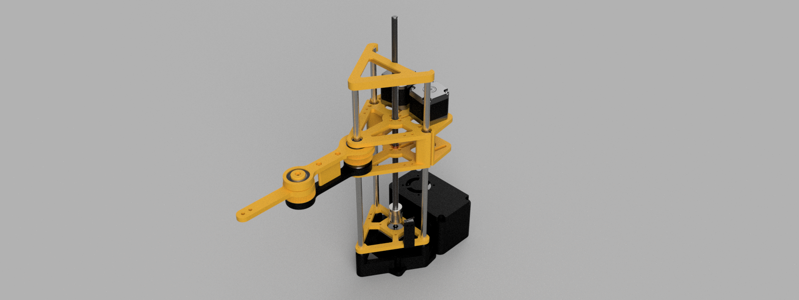
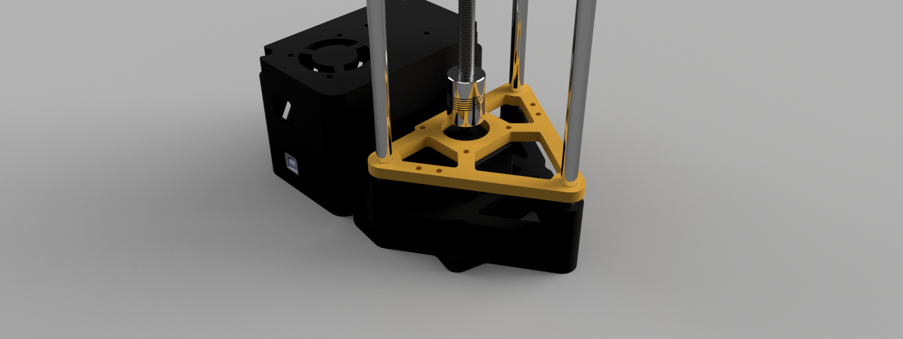
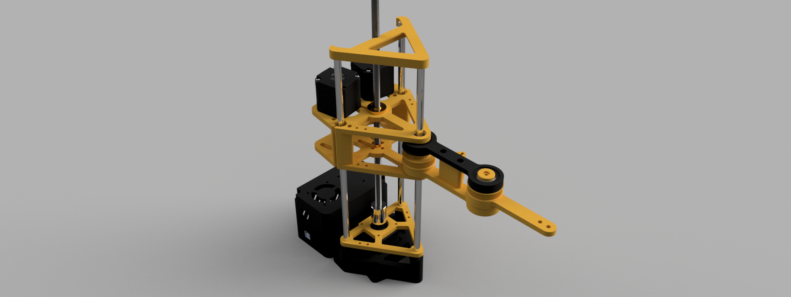
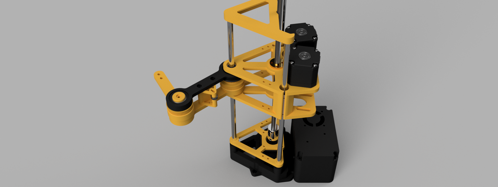

# SCARA

The SCARA (Selective Compliance Assembly Robot Arm) is a type of robotic arm designed for tasks requiring high precision and speed, like assembly and pick-and-place operations. Its configuration allows for rigid vertical movement while maintaining flexibility in the horizontal plane. 

This repository contains the design files, source code, and documentation for my robotic arm. The arm is mostly 3d printed in order to offer a balance between affordability and functionality.

## ⚠️ Work in Progress

This project is actively under development. Features are being added, refined, and tested continuously.

## 📷 Renders and examples

<table>
  <tr>
    <td></td>
    <td></td>
  </tr>
  <tr>
    <td></td>
    <td></td>
  </tr>
  <tr>
    <td></td>
    <td></td>
  </tr>
</table>

## 🔧 Repositories

The project is split into several repositories. Each one focuses on a specific aspect:

1. **[OpenSCARA-Software](https://github.com/ggldnl/OpenSCARA-Software)**
   - Contains the software that runs on the robot arm.
   - Handles low-level stepper control and inverse kinematics computation.
   
2. **[OpenSCARA-Simulation](https://github.com/ggldnl/OpenSCARA-Simulation)**
   - Implements a simulation environment using PyBullet.
   - Useful for testing the arm without requiring on the actual robot.

3. **[OpenSCARA-Hardware](https://github.com/ggldnl/OpenSCARA-Hardware)**
   - Includes 3D-printable files for the arm (and the link to the MakerWorld model page for print profiles).
   - Contains a Bill of Materials and assembly guides.

## 🎯 Goals

- Experiment with my robot and annotate everything I do.
- Offering detailed guides for replicating the project.
- Providing accessible resources for everyone to build their own SCARA.

## 🤝 Contribution

Feel free to contribute by opening issues or submitting pull requests. 
Give a ⭐️ to this project if you liked the content.
